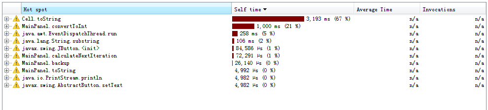
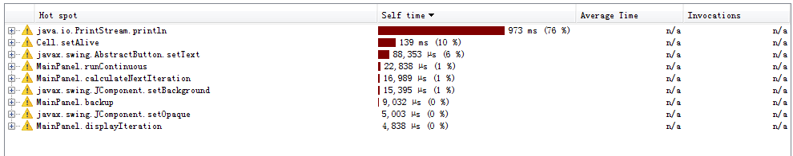

## IS2545 - Deliverable4

#### Exploratory Testing
Before starting profiling, I applied exploratory testing to see which methods may need to be improved. I noticed in Cell.java, the method toString() uses a very tedious way to determine whether the cell is dead or alive. Also I found in MainPanel.java, the method runContinuous() has some non-meaningful code inside, including a loop, which could cost a lot of time.

#### Profiling - Before
Then I used JProfiler to verify my exploration. Below is a screenshot of the application hot spot.

From the screenshot, it can be seen that the most CPU-intensive methods are: Cell.toString(), MainPanel.covertToInt(), MainPanel.calculateNextIteration(), MainPanel.backup(). It is weird that the MainPanel.runContinuous() is not on the list. 

#### Method Modification
I found what causes MainPanel.convertToInt() cost so much running time is MainPanel.getNumNeighbors(). In MainPanel.getNumNeighbors() method, it returns an integer by calling MainPanel.convertToInt(). Thus, for this application, I modified four methods: Cell.toString(), MainPanel.getNumNeighbors(), MainPanel.backup() and MainPanel.runContinuous(). 

#### Pinning Test
For the first three methods, I used unit test to show the functionalities are unchanged by my modifications. However, it is hard to use code to test the last method. So I used manual test to include three test cases on the last method.

#### Profiling - After
After modification and passed all the unit tests, I used JProfiler again to show my modification can make the methods more performant. In order to make it comparable, I select the same cells in the panel, and then use “Run Continuous” button to run the application. As soon as the pattern stop changing, I stop the application.
Below is a screenshot of the application with modified methods.

Compared to the first screenshot, it can be seen that Cell.toString(), MainPanel.getNumNeighbors() and MainPanel.convertToInt() now are not hot spots of the application. The run time of MainPanel.backup() greatly decreased from 26,140 us to 9,032 us.
